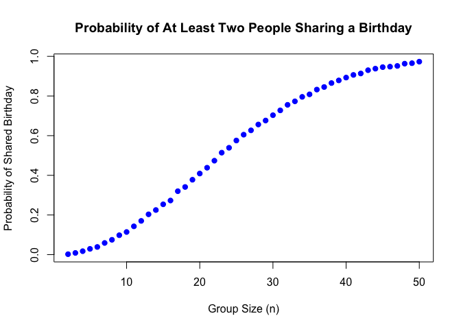
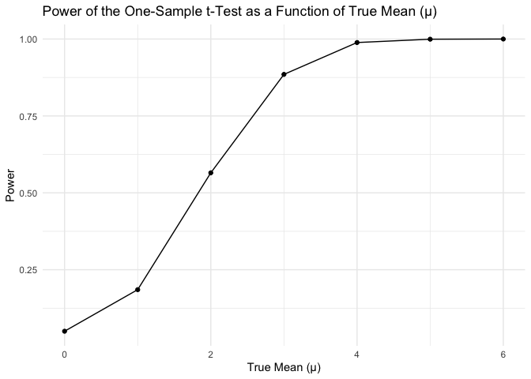
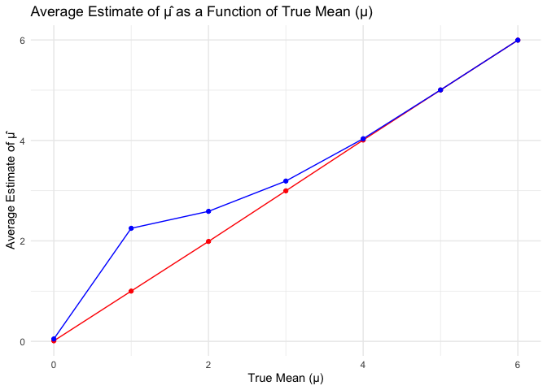
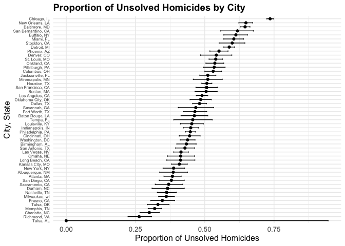

p8105_hw5_map2365
================

# Problem 1

*function that checks for duplicate birthdays*

``` r
simulate_birthdays <- function(group_size) {
birthdays <- sample(1:365, group_size, replace = TRUE)
any(duplicated(birthdays))
}
```

*running the simulation for group sizes between 2 and 50. Note, I set
the seed for reproducibility purposes.*

``` r
set.seed(1123)
group_sizes <- 2:50
n_simulations <- 10000

probabilities <- numeric(length(group_sizes))

for (i in seq_along(group_sizes)) {
  group_size <- group_sizes[i]
  results <- replicate(n_simulations, simulate_birthdays(group_size))
  probabilities[i] <- mean(results)
}
```

*ploting the results*

``` r
plot(group_sizes, probabilities, type = "b", 
     xlab = "Group Size (n)", 
     ylab = "Probability of Shared Birthday",
     main = "Probability of At Least Two People Sharing a Birthday",
     pch = 19, col = "blue")
```

<!-- -->

*based on the plot, we can see that the probability of two people
sharing a birthday increases as the size of the group increases. In
fact, when the group size reaches 50, there is nearly the probability of
2 people sharing a birthday is nearly 100%*

# Problem 2

``` r
# Set simulation parameters
n <- 30              # Sample size
sigma <- 5           # Standard deviation
alpha <- 0.05        # Significance level
n_simulations <- 5000  # Number of simulations per mean

# Define function to perform simulations for a given mean (mu)
simulate_for_mu <- function(mu) {
  # Initialize vectors to store results
  estimates <- numeric(n_simulations)
  p_values <- numeric(n_simulations)
  
  # Run simulations
  for (i in 1:n_simulations) {
    # Generate random sample
    data <- tibble::tibble(x = rnorm(n, mean = mu, sd = sigma))
    
    # Perform t-test and extract estimate and p-value
    t_test_result <- t.test(data$x, mu = 0)
    t_test_tidy <- broom::tidy(t_test_result)
    
    # Store results
    estimates[i] <- t_test_tidy$estimate
    p_values[i] <- t_test_tidy$p.value
  }
  
  # proportion of p-values less than alpha
  power <- mean(p_values < alpha)
  
  # average estimates
  avg_estimate_all <- mean(estimates)
  avg_estimate_rejected <- mean(estimates[p_values < alpha])
  
  # results as a list
  list(mu = mu,
       power = power,
       avg_estimate_all = avg_estimate_all,
       avg_estimate_rejected = avg_estimate_rejected)
}

# simulations for each value of mu in {0, 1, 2, 3, 4, 5, 6}
mu_values <- 0:6
results <- lapply(mu_values, simulate_for_mu)

# Convert results to a data frame
results_df <- bind_rows(lapply(results, as.data.frame))
```

*power vs. true mean (mu) plot*

``` r
ggplot(results_df, aes(x = mu, y = power)) +
  geom_line() +
  geom_point() +
  labs(
    title = "Power of the One-Sample t-Test as a Function of True Mean (μ)",
    x = "True Mean (μ)",
    y = "Power"
  ) +
  theme_minimal()
```

<!-- -->

*The plot of power (proportion of times the null was rejected) vs. true
mean shows that power tends to increases with effect size (mu). As mu
moves further from zero, it becomes more likely that we correctly reject
the null hypothesis. This suggests that larger effect sizes make it
easier to detect a significant result.*

*Plotting average estimate of mu_hat vs. true mean (mu)*

``` r
ggplot(results_df, aes(x = mu)) +
  geom_line(aes(y = avg_estimate_all), color = "red") +
  geom_point(aes(y = avg_estimate_all), color = "red") +
  geom_line(aes(y = avg_estimate_rejected), color = "blue") +
  geom_point(aes(y = avg_estimate_rejected), color = "blue") +
  labs(
    title = "Average Estimate of μ̂ as a Function of True Mean (μ)",
    x = "True Mean (μ)",
    y = "Average Estimate of μ̂"
  ) +
  theme_minimal() +
  scale_color_manual(values = c("All Samples" = "red", "Rejected Null" = "blue")) +
  guides(color = guide_legend(title = "Estimate Type"))
```

    ## Warning: No shared levels found between `names(values)` of the manual scale and the
    ## data's colour values.

<!-- -->

*The average mu across all samples closely follows the true mu which
suggests an unbiased estimate. However, the average mu for only the
rejected samples is higher than the true mu and this is especially
evident at smaller effect sizes. This bias likely results because only
samples with more extreme mu values are likely to reject the null,
skewing the average upward.*

# Problem 3

``` r
# Importing and cleaning data
url <- "https://raw.githubusercontent.com/washingtonpost/data-homicides/master/homicide-data.csv"
if (!dir.exists("data")) {
  dir.create("data")
}
download.file(url, destfile = "data/homicide_data.csv") 

homicide_data <- readr::read_csv("data/homicide_data.csv") %>%
  janitor::clean_names()
```

    ## Rows: 52179 Columns: 12
    ## ── Column specification ────────────────────────────────────────────────────────
    ## Delimiter: ","
    ## chr (9): uid, victim_last, victim_first, victim_race, victim_age, victim_sex...
    ## dbl (3): reported_date, lat, lon
    ## 
    ## ℹ Use `spec()` to retrieve the full column specification for this data.
    ## ℹ Specify the column types or set `show_col_types = FALSE` to quiet this message.

``` r
# created city_state and summarized data
city_summary <- homicide_data %>%
  dplyr::mutate(city_state = paste(city, state, sep = ", ")) %>%
  dplyr::group_by(city_state) %>%
  dplyr::summarize(
    total_homicides = dplyr::n(),
    unsolved_homicides = sum(disposition %in% c("Closed without arrest", "Open/No arrest")),
    .groups = "drop"  # Remove group structure after summarizing
  )

# for Baltimore, MD
baltimore_data <- city_summary %>% dplyr::filter(city_state == "Baltimore, MD")

baltimore_prop <- prop.test(
  baltimore_data$unsolved_homicides,
  baltimore_data$total_homicides
) %>%
  broom::tidy() %>%
  dplyr::select(estimate, conf.low, conf.high)  # Extract estimate and confidence intervals

# for all cities
city_props <- city_summary %>%
  dplyr::mutate(
    test_results = purrr::map2(
      unsolved_homicides,
      total_homicides,
      ~ prop.test(.x, .y) %>% broom::tidy()
    )
  ) %>%
  tidyr::unnest(test_results) %>%
  dplyr::select(city_state, estimate, conf.low, conf.high)  # Keep only relevant columns

# Plot estimates and confidence intervals
ggplot2::ggplot(city_props, ggplot2::aes(x = reorder(city_state, estimate), y = estimate)) +
  ggplot2::geom_point() +
  ggplot2::geom_errorbar(ggplot2::aes(ymin = conf.low, ymax = conf.high), width = 0.3) +
  ggplot2::coord_flip() +
  ggplot2::labs(
    title = "Proportion of Unsolved Homicides by City",
    x = "City, State",
    y = "Proportion of Unsolved Homicides"
  ) +
  ggplot2::theme_minimal() +
  ggplot2::theme(
    axis.text.y = ggplot2::element_text(size = 6),  
    axis.text.x = ggplot2::element_text(size = 10), 
    axis.title = ggplot2::element_text(size = 12),  
    plot.title = ggplot2::element_text(size = 14, face = "bold")  
  )
```

<!-- -->

*The dataset has 52179 observations and 12 variables. The variables
include uid, reported_date, victim_last, victim_first, victim_race,
victim_age, victim_sex, city, state, lat, lon, disposition.*
